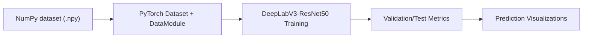
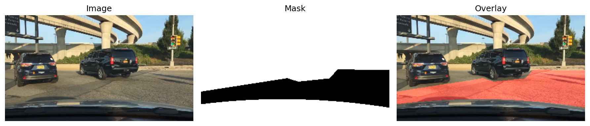
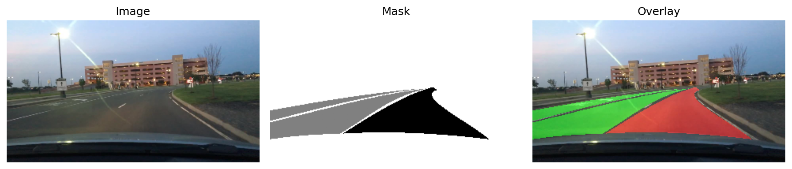
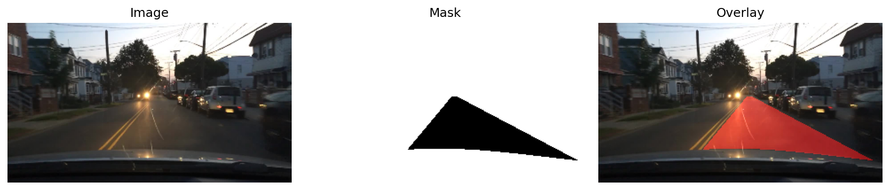
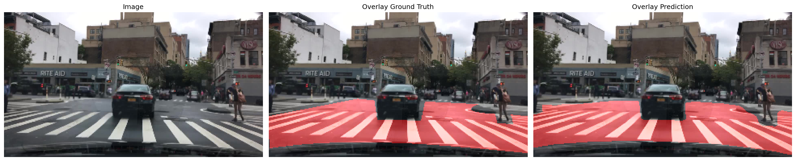
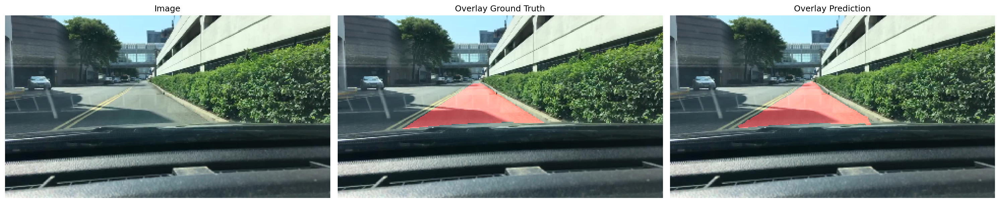
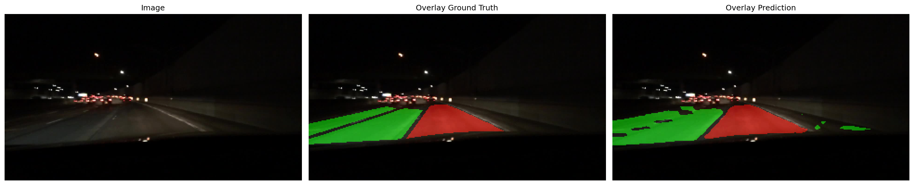

# Driver Lane Segmentation with DeepLabV3-ResNet50

## Project Overview

This project solves a 3-class lane segmentation task:

- **Class 0**: Direct lane
- **Class 1**: Alternative lane
- **Class 2**: Background / non-lane

### Class annotation legend used in visual outputs

- **Class 0 (Direct lane)**: RGB `(255, 0, 0)` → **Red**
- **Class 1 (Alternative lane)**: RGB `(0, 255, 0)` → **Green**
- **Class 2 (Background / non-lane)**: RGB `(0, 0, 0)` → **Black**

In overlay images, these colors are blended with the road image to compare lane region quality.

The core objective is to produce robust pixel-level predictions under realistic road-scene variation.

### Pipeline Summary

---

## Dataset Source

This work uses the BDD100K drivable-area style data downloaded from:

- **BDD100K Download Page**: http://bdd-data.berkeley.edu/download.html

In this project, images and labels are in numpy format:

- `data/train/image_180_320.npy`
- `data/train/label_180_320.npy`
- `data/val/image_180_320.npy`
- `data/val/label_180_320.npy`

---

## Methodology

### Data Preparation

- Input RGB images are resized to **180x320** and stored as `uint8`.
- Label IDs are remapped to project classes and ignore regions are preserved.
- During training, samples are padded from height **180 -> 192** to improve compatibility with encoder-decoder downsampling behavior.
- Image normalization follows ImageNet statistics for transfer learning stability.

### Model Architecture

- **Backbone**: ResNet-50 (pretrained)
- **Segmentation Head**: DeepLabV3 classifier + auxiliary head
- **Loss**: CrossEntropy + weighted auxiliary loss
- **Optimizer**: AdamW
- **Scheduler**: ReduceLROnPlateau monitored by validation mIoU
- **Stopping Strategy**: EarlyStopping on validation mIoU

This setup balances practical training stability and competitive segmentation quality.

---

## Quantitative Results

| Split | mIoU | Accuracy | Precision | Recall | F1 |
|---|---:|---:|---:|---:|---:|
| Validation | 0.8347 | 0.9060 | 0.9063 | 0.9060 | 0.9061 |
| Test | 0.8317 | 0.9045 | 0.9035 | 0.9045 | 0.9040 |

Per-class IoU (Validation):

- Class 0 (Direct lane): 0.8280
- Class 1 (Alternative lane): 0.7050
- Class 2 (Background): 0.9713

Interpretation:

- Background is the easiest class in this setting and obtains the highest IoU.
- Direct lane quality is reasonably good.
- Alternative lane is the most difficult class and has the lowest IoU, which suggests room for improvement in minority/ambiguous regions.

---

## Training Preview Visualizations

### Preview 1

### Preview 2

### Preview 3

---

## Prediction Comparison Visualizations

### Prediction 1

### Prediction 2

### Prediction 3

---

## Limitations

- **Class imbalance effect**: Background pixels dominate, which can make minority lane classes harder to optimize.
- **Alternative-lane difficulty**: Class 1 has lower IoU than Class 0 and Class 2, indicating weaker boundary/region consistency in harder scenarios.
- **Single-backbone baseline**: Only DeepLabV3-ResNet50 is reported here; no backbone/loss ablation is included yet.
- **Resolution trade-off**: Training at 180x320 (with padding) is efficient but may lose fine lane details compared to higher-resolution training.
- **Domain robustness not fully tested**: Results are from one project setting; cross-weather, cross-time, or cross-city generalization is not deeply evaluated.

---

## Conclusion

This project demonstrates a complete lane segmentation workflow from data conversion to model training and visual evaluation.  
The current results are promising for a baseline model, especially on background and direct-lane regions, but performance is weaker on alternative-lane regions.  
Overall, the pipeline is stable and usable as a foundation for further work, particularly in class-balance handling, augmentation design, and backbone/loss comparisons.
